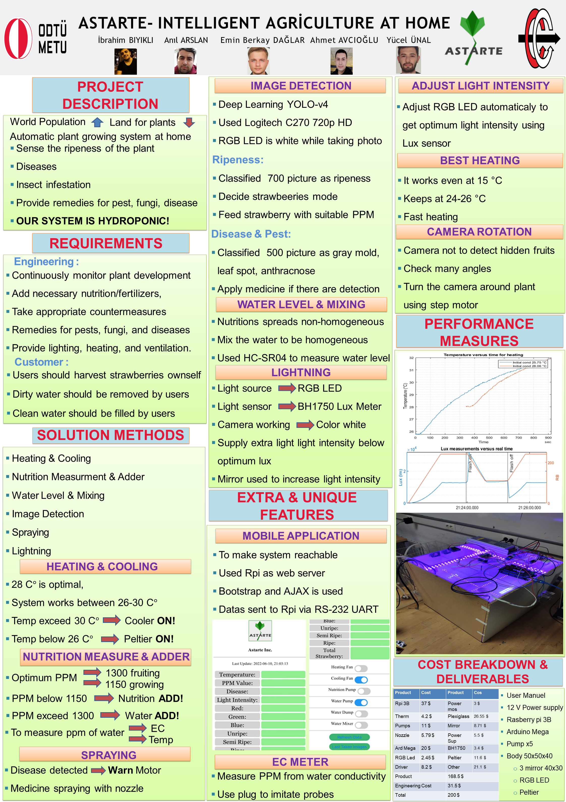
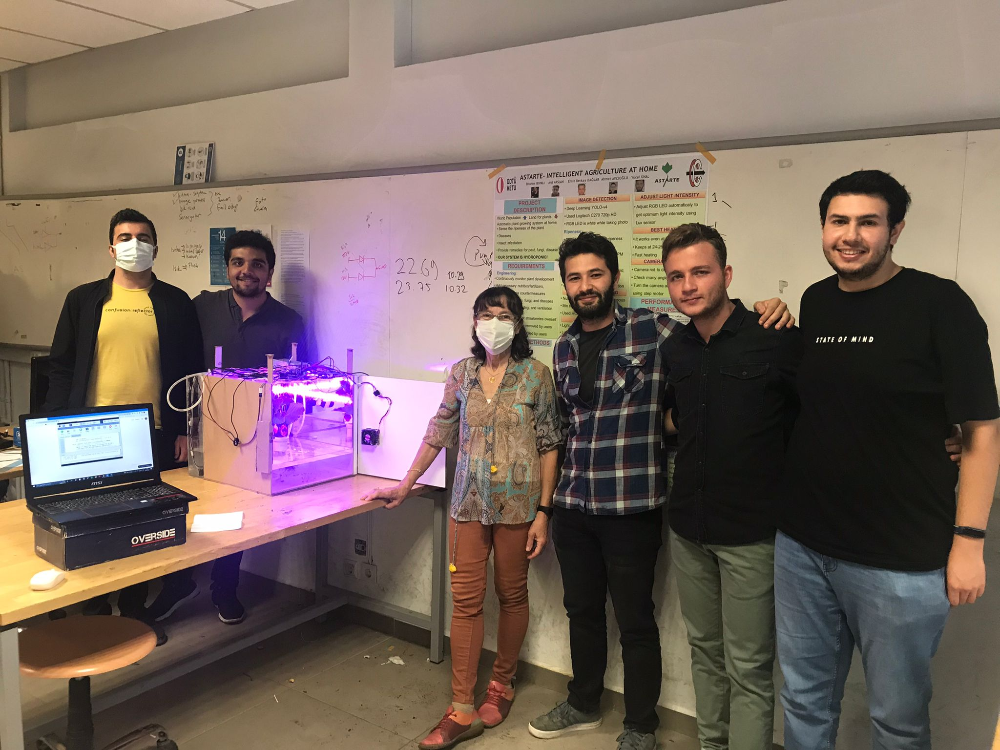

# ASTARTE-web
The web side of our capstone project Astarte Smart Agriculture System. 
- The system that we designed continuously monitor the plant(the plant is strawberry in our case).
- We used Raspberry Pi3B+ and Arduino Mega2560. The humidity, temperature, water level sensors, ec meter and lux meter is connected 
to the Arduino. We take measurements from these and send the data to the Raspberry via UART serial communication.
- The raspberry act as web server, we used Flask mini web-framework. Raspberry show the data in main menu via jinja template.
- A webcam is connected to the Raspberry. It takes the picture of the plant once in a day, and then it makes ripeness and disease detection analysis. 
- Strawberries require around 1300ppm when they are in fruiting mode, and 1150 ppm when they are in flowering era.
- According to the detections, if a ripe/semiripe/unripe detected, the system adjust the ppm limit to 1300ppm, if not it adjust the limit to 1150 ppm.
- Secondly, if a disease detected, the system sends the disease signal to
the arduino and arduino open its nozzle for 3 seconds to spray pesticide to the plant. 

 
The Project Poster

 
The Astarte Team and Our Advisor

